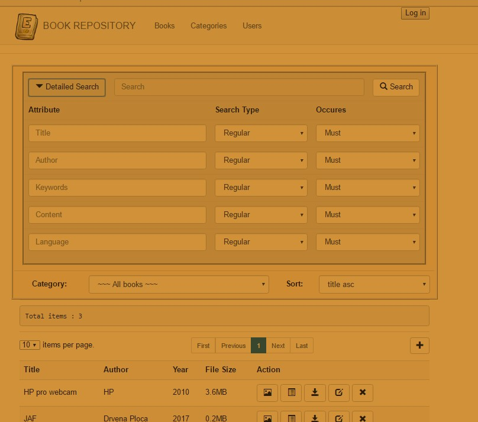
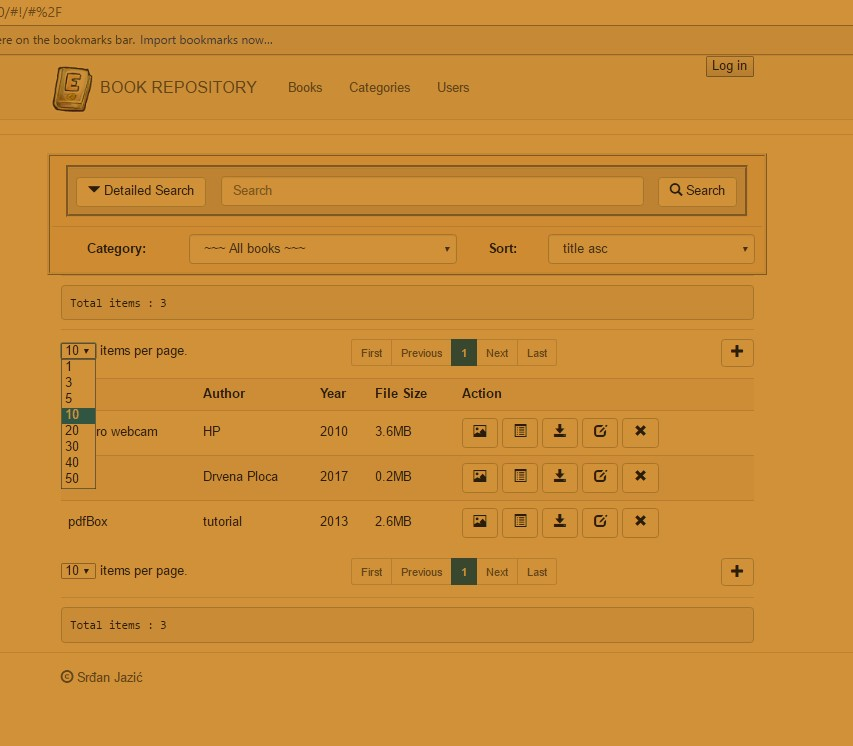
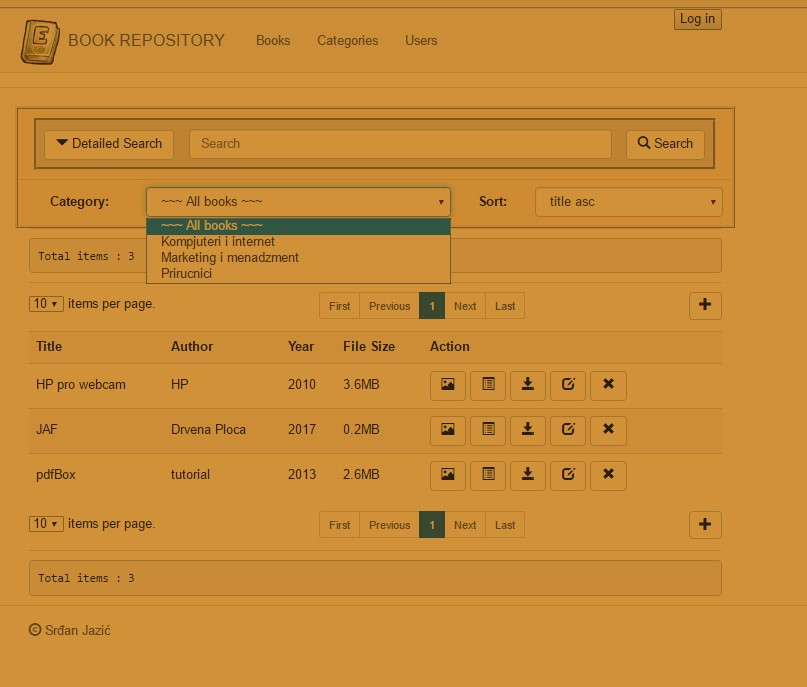
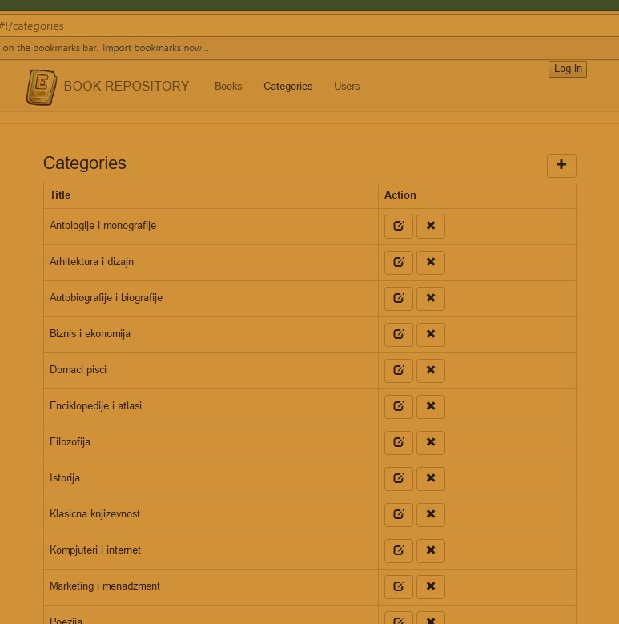
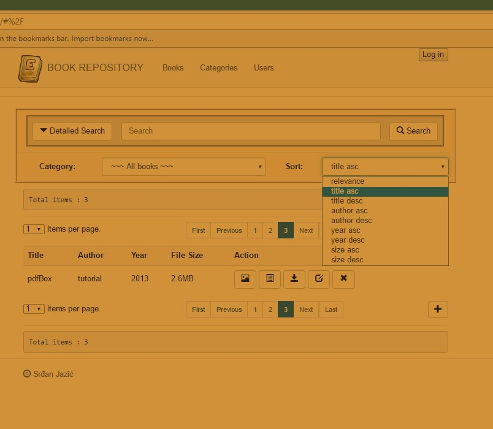
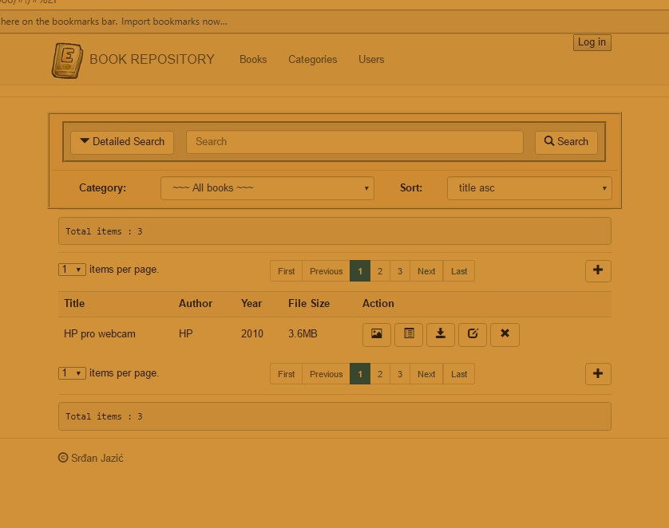
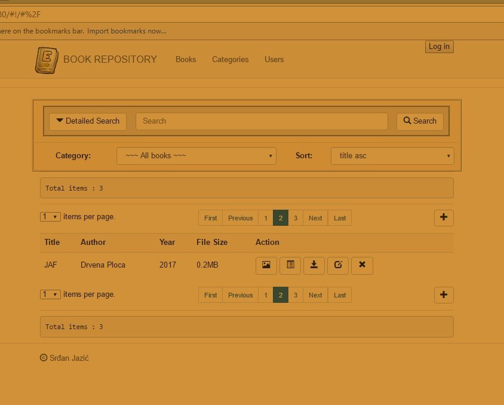
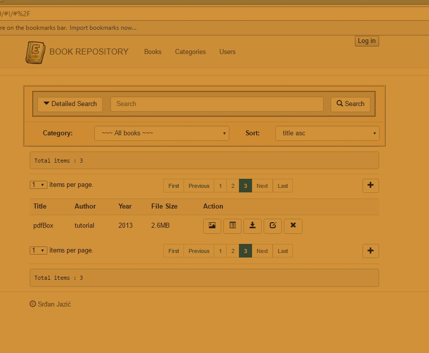
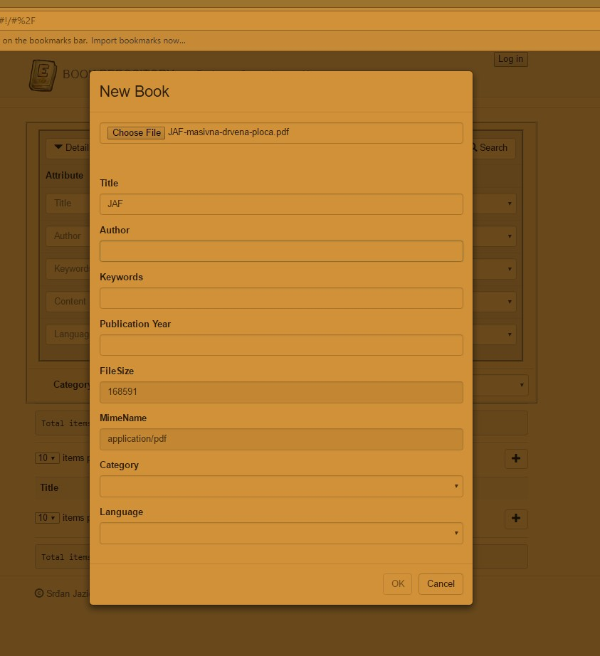

# ebook - repo #

Web App that implements CRUD operations, Hibernate Search and PDF manipulation(save, view, download...)

* [ Java 1.8 ](http://www.oracle.com/technetwork/java/javase/downloads/jdk8-downloads-2133151.html)
* [ JavaScript ](https://www.javascript.com/)
* [ AngularJS ](https://docs.angularjs.org/guide) - FrontEnd 
* [ SpringBoot framework ](https://projects.spring.io/spring-boot/) - BackEnd
* [ Gradle ](https://gradle.org/docs/) - Dependency Management
* [ Hibernate Search ](http://hibernate.org/search/releases/5.7/)

### Import as 'Existing Gradle Project'

### Detailed search

### Items per page

### Categories

### Sort

### Pagination

### New ebook

## Acknowledgments

* This project is developed as part of exam on Faculty of Technical Sciences in Novi Sad